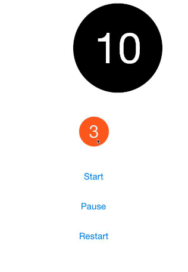

# JLCountdownView
<p align="center"></p>
<p align="center">(Dropping animations not included!)</p>

### Project Details
JLCountdownView is a UIView subclass that creates a customizable circular countdown timer with a simple pulsing animation.  The view is placed via a point with a specified radius.  Actions can be triggered via a delegate method once the timer has finished firing.

### Requirements
* iOS 6+
* ARC

###Documentation
---
####Installation
1. Download or clone JLCountdownView, add `JLCountdownView.h` and `JLCountdownView.m` source files into your project.
2. `#import "JLCountdownView.h"` wherever it's needed.

####Example
In place default timer at the center of the screen with a 3 second countdown.
 ```objective-c
    JLCountdownView *cdv = [JLCountdownView countdownTimerInView:self.view];
    cdv.delegate = self;
    [cdv start];
 ````
 
 Slightly more customized timer
 ```objective-c
    JLCountdownView *cdv = [JLCountdownView countdownTimerAtPoint:CGPointMake(100, 100) radius:100 time:5];
    [self.view addSubview:cdv];
    [cdv start];
 ````
 
####Custom Appearance
Appearance changes to the circle color, text color, and text font are accessible via properties.
  ```objective-c
    JLCountdownView *blackWhiteCdv = [JLCountdownView countdownTimerInView:self.view];
	blackWhiteCdv.circleColor = [UIColor blackColor];
	blackWhiteCdv.textColor = [UIColor whiteColor];
	blackWhiteCdv.textFont = [UIFont systemFontOfSize:36];
	[blackWhiteCdv start];
 ````
 
Size and position changes are achieved via modifying the point and radius properties.  No need to alter any CGRect structures.
 ```objective-c
    JLCountdownView *cdv = [JLCountdownView countdownTimerInView:self.view];
    cdv.point = CGPointMake(200,200);
    cdv.radius = 100;
    [cdv start];
 ````
####Timing Changes
The total amount of time as well as the time interval can be changed via properties:
 ```objective-c
    JLCountdownView *cdv = [JLCountdownView countdownTimerInView:self.view];
    cdv.time = 10;
    cdv.timeInterval = 2;
 ````

####Timer Controls
The timer controls support starting (resuming), pausing, and restarting.  Create the object and call these methods:
 ```objective-c
    - (void)start;
    - (void)pause;
    - (void)restart;
 ````
 
####Constructors
 ```objective-c
 Three constructors are provided for easily creating a new view and positioning/sizing it.
// Constructor for a centered in-place timer counting down from 3 with an orange circle and white text
+ (instancetype)countdownTimerInView:(UIView *)view;

// Custom constructor to set the point and size of the circle (and time (optional))
+ (instancetype)countdownTimerAtPoint:(CGPoint)point radius:(CGFloat)radius;
+ (instancetype)countdownTimerAtPoint:(CGPoint)point radius:(CGFloat)radius time:(NSInteger)time;
 ````
 
####Timer finish and delegate handling

First, set the delegate of the timer label:
`timer.delegate = self;`

Next, implement the `JLCountdownViewDelegate` protocol in your controller:
`@interface ViewController : UIViewController<JLCountdownViewDelegate>`

Finally, implement the delegate method:
`countdownViewDidFinish:`

 ```objective-c 
	- (void)countdownViewDidFinish:(JLCountdownView *)view {
		NSLog(@"Timer done!");
	}
 ````
 
####License
MIT License, free for use, no attribution required.
